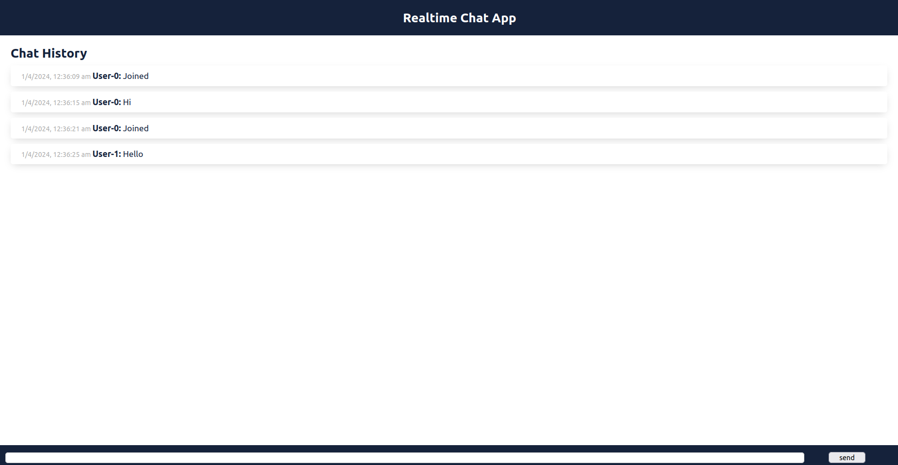

# Realtime chat app using Golang and React

Welcome to Realtime Chat App - a modern and feature-rich chat application built with React and Go! This project aims to provide a seamless and enjoyable chat experience for users, with real-time messaging and a user-friendly interface.

## Features

- **Real-Time Messaging**: Engage in real-time conversations with other users.
- **Message Notifications**: Receive notifications for new messages to stay updated.
- **Responsive Design**: Enjoy a seamless chat experience on any device - desktop, tablet, or mobile.
- **Cross-Platform Compatibility**: Compatible with all major web browsers.

## Technologies Used

- **Frontend**:

  - React
  - WebSocket (for real-time communication)

- **Backend**:
  - Go
  - Gorilla WebSocket (for WebSocket implementation)

## Getting Started

To get started with Realtime Chat App, follow these steps:

1. **Clone the repository:**

    `git clone https://github.com/yourusername/go-chat.git`

2. **Navigate to project directory:**

    `cd go-chat`

3. **Build the image and run the container:**

    `docker-compose up`

4. Open your web browser and navigate to http://localhost:3000 to access the chat application.

## Contributing

Any contributions from the community is welcome! If you'd like to contribute to Realtime Chat App, please follow these guidelines:

1. **Fork the repository and create your branch:**

    `git checkout -b feature/new-feature`

2. **Make your changes and commit them:**

    `git commit -m "Add new feature"`

3. **Push to your branch:**
    `git push origin feature/new-feature`

4. **Create a pull request with a detailed description of your changes.**

## License

This project is licensed under the [MIT License](LICENSE).
